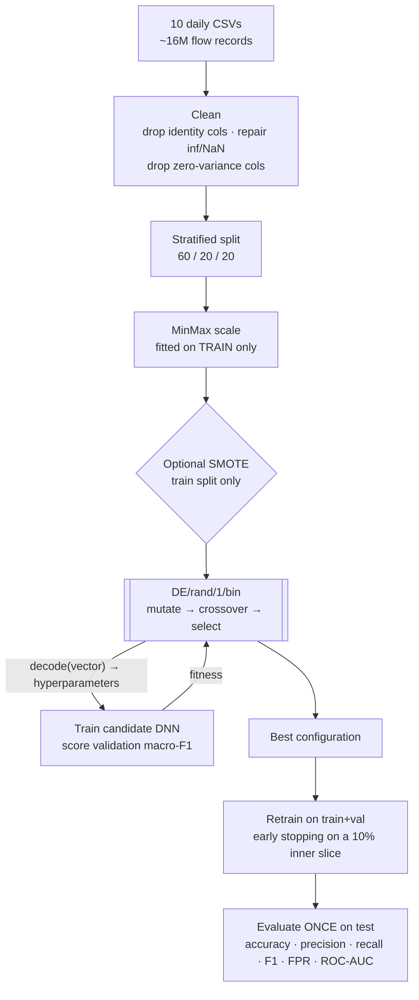

# DE-DNN-IDS

**Differential Evolution optimised Deep Neural Network for Network Intrusion Detection**

[](https://www.python.org/)
[](https://www.tensorflow.org/)
[](LICENSE)

A hand-implemented **DE/rand/1/bin** differential evolution optimiser that searches
the architecture and training hyperparameters of a deep neural network for
network intrusion detection on **CSE-CIC-IDS2018**, using **validation macro-F1**
as the fitness signal.

> B.Sc. Computer Science final-year project · University of Lagos
> Author: **Florish Adekogbe** (190805025) · Supervisor: **Dr. B. A. Sawyerr**

---

## Why this project

Deep neural networks work well for intrusion detection, but their performance is
dominated by choices nobody can derive analytically: how deep, how wide, what
learning rate, how much dropout. Those choices are usually made by hand or by
grid search.

This project replaces that guesswork with **Differential Evolution**, a
population-based, derivative-free optimiser. DE is the right tool here because the
search space is hostile to gradient methods:

| Property of the search space | Consequence |
|---|---|
| Non-differentiable | You cannot take ∂(macro-F1)/∂(number of layers) |
| Non-convex | Many local optima; hill-climbing gets stuck |
| Mixed discrete + continuous | Layer count is an integer, learning rate is a real |
| Expensive to evaluate | Each fitness call is a full network training run |

The second design decision matters as much as the first: fitness is **macro-F1,
not accuracy**. CSE-CIC-IDS2018 is ~83% benign traffic, so a model that predicts
"Benign" for every flow scores ~83% accuracy while detecting nothing. Macro-F1
weights every class equally, forcing the search to care about rare attack
families — which are precisely the ones a real adversary uses.

---

## Pipeline



### The search space

DE searches the continuous unit hypercube `[0,1]⁶`; `decode()` maps each vector
onto concrete network settings.

| Gene | Hyperparameter | Range | Mapping |
|---|---|---|---|
| 0 | Hidden layers | 1 – 5 | linear, rounded |
| 1 | Neurons per layer | 32 – 512 | linear, rounded |
| 2 | Learning rate | 1e-4 – 1e-1 | **logarithmic** |
| 3 | Dropout | 0.0 – 0.5 | linear |
| 4 | Batch size | {16, 32, 64, 128, 256} | index |
| 5 | Activation | {relu, tanh, sigmoid} | index |

The learning rate is mapped **logarithmically** on purpose. A linear map from
1e-4 to 1e-1 would spend 99.9% of the gene's range above 1e-3, where Adam rarely
converges well, so DE would almost never sample the region that actually works.

### DE operators

```
mutation    v_i = x_r1 + F · (x_r2 − x_r3)        F  = 0.8
crossover   binomial, gene-wise                    CR = 0.9, with a forced j_rand gene
selection   greedy, one-to-one, elitist            child replaces parent iff score ≥ parent
```

The mutation step is what makes DE self-adapting: the difference vector is drawn
from the **population's own spread**. Early on the population is scattered, so
steps are large and exploratory; once it converges on a region the differences
shrink and the steps become fine refinements. There is no cooling schedule to tune.

---

## Results

> ⚠️ **Preliminary.** The numbers below come from a reduced pilot run, not the
> final experiment. They are published here for transparency and will be replaced
> once the full-scale run completes.

**Configuration** — 5% stratified subsample of four capture days
(`02-14`, `02-15`, `02-22`, `03-02`), 9 classes, 70 features after cleaning.
239,000 flows: 143,400 train / 47,800 validation / 47,800 test.
DE budget: `pop_size=6`, `generations=5` → 36 fitness evaluations.

**Configuration selected by DE**

| Hyperparameter | Value |
|---|---|
| Hidden layers | 4 |
| Neurons per layer | 156 |
| Learning rate | 1.706e-3 |
| Dropout | 0.087 |
| Batch size | 32 |
| Activation | sigmoid |

**Test-set performance**

| Metric | Value |
|---|---|
| Accuracy | 0.9849 |
| Precision (macro) | 0.7333 |
| Recall (macro) | 0.7475 |
| **F1 (macro)** | **0.7481** |
| False-positive rate | 0.0110 |
| ROC-AUC (macro OVR) | *not computable — see below* |

<!-- Drop your figures into docs/images/ and these will render.
     Suggested filenames are already referenced below. -->

| DE convergence | Confusion matrix |
|---|---|
|  |  |

### Reading these results honestly

The **98.5% accuracy against a 0.75 macro-F1 is the whole story of this dataset**,
and the gap is the point rather than a defect. Benign traffic dominates, so
accuracy is nearly free; macro-F1 exposes that several rare attack classes are
still being missed. This is exactly why macro-F1, not accuracy, drives the
optimisation.

Two honest caveats on the pilot run:

1. **The DE search was too small to have converged.** Best fitness moved from
   0.6574 to 0.6575 across five generations — essentially flat. With a population
   of 6 in a 6-dimensional space, DE barely has enough diversity to form useful
   difference vectors. The published guidance is `pop_size ≈ 10 × dim`; the final
   run uses `pop_size=20, generations=50`.
2. **Two classes are starved at a 5% sample.** `SQL Injection` has ~87 flows in
   the entire corpus and `Brute Force -XSS` ~230. At 5% that is ~4 and ~11 flows
   respectively, leaving roughly **zero** in the test split. This is what makes
   ROC-AUC uncomputable — scikit-learn cannot score a one-vs-rest AUC for a class
   with no positive samples — and it drags macro-F1 down mechanically, because a
   class with no support scores 0.0 and still counts as 1/9 of the average.

The pipeline now prints per-class test support before training and flags any
class with fewer than 30 test flows, so this is visible up front rather than as a
failure at the reporting stage.

---

## Installation

```bash
git clone https://github.com/von-moyo/de-dnn-ids.git
cd de-dnn-ids

python -m venv venv
source venv/bin/activate          # Windows: venv\Scripts\activate

pip install -r requirements.txt
```

Then fetch the dataset into `data/` — see [`data/README.md`](data/README.md).

> **Windows + GPU:** TensorFlow 2.11+ dropped native Windows GPU support. Use
> WSL2, `tensorflow-directml-plugin`, or Google Colab (Runtime → Change runtime
> type → GPU). On CPU the full search is not practical.

---

## Usage

```bash
# Full experiment (multi-class, 9+ attack families)
python de_dnn_ids.py --data_dir ./data --mode multiclass

# Binary detection: benign vs attack
python de_dnn_ids.py --data_dir ./data --mode binary

# Fast development run on a 5% subsample with a small search budget
python de_dnn_ids.py --sample_frac 0.05 --pop_size 6 --generations 5

# Balance rare classes with SMOTE (training split only)
python de_dnn_ids.py --use_smote
```

### Recommended two-stage protocol

The default budget is `pop_size × (1 + generations) = 1,020` full network
trainings. On the complete 16M-flow dataset that is not feasible. Run the search
cheaply, then retrain the winner at full scale:

```bash
# Stage 1 — search on a subsample (hours)
python de_dnn_ids.py --sample_frac 0.05 --pop_size 20 --generations 50

# Stage 2 — retrain the winning configuration on everything (once)
python de_dnn_ids.py --sample_frac 1.0 --load_config results/best_config.json
```

This is a standard **fidelity-reduction** strategy: DE converges on the *relative
ranking* of hyperparameters, and that ranking is largely stable across sample
sizes even though absolute scores are not.

### Arguments

| Flag | Default | Description |
|---|---|---|
| `--data_dir` | `./data` | Directory containing the CSE-CIC-IDS2018 CSVs |
| `--out_dir` | `./results` | Where figures, metrics and the model are written |
| `--mode` | `multiclass` | `binary` or `multiclass` |
| `--sample_frac` | `1.0` | Stratified per-file subsample, e.g. `0.05` |
| `--use_smote` | off | Oversample minority classes in the training split |
| `--pop_size` | `20` | DE population size |
| `--generations` | `50` | DE generations |
| `--fitness_epochs` | `20` | Epoch budget per DE candidate |
| `--final_epochs` | `100` | Epoch budget for the retrained winner |
| `--seed` | `42` | Seeds Python, NumPy, TensorFlow and all splits |
| `--load_config` | — | Skip the search; retrain a saved `best_config.json` |

### Outputs

Every run writes to `--out_dir`:

| File | Contents |
|---|---|
| `best_config.json` | Winning hyperparameters, raw DE vector, full convergence history, and the exact run settings |
| `de_convergence.png` | Best validation macro-F1 per generation |
| `confusion_matrix.png` | Annotated heatmap |
| `confusion_matrix.csv` | Raw counts, for your own tables |
| `classification_report.txt` | Per-class precision / recall / F1 / support |
| `metrics.json` | Headline test metrics |
| `de_dnn_best.keras` | The trained final model |

---

## Methodology notes

These are the decisions an examiner is most likely to probe.

**Leakage control.** The test set is read exactly once, inside `evaluate()`.
Concretely:

- **Identity columns are dropped first.** `Src IP`, `Dst IP`, `Flow ID` and
  `Timestamp` are removed before anything else. The attacks in this dataset were
  launched from a fixed set of hosts during known windows, so a model that keeps
  them learns *"traffic from 18.219.211.138 is malicious"* rather than what an
  attack looks like — near-perfect on paper, useless in production. `Dst Port` is
  deliberately **kept**: it is genuine protocol signal.
- **The scaler is fitted on the training split only.** Splitting happens *before*
  scaling, and validation and test are transformed with training statistics.
- **SMOTE runs after the split, on training data only.** Applied beforehand it
  would synthesise training points by interpolating test samples.
- **Early stopping never sees the test set.** During the final retrain a 10%
  stratified slice is carved out of train+val to drive early stopping. Monitoring
  the test set there would mean selecting weights on the same data the results are
  reported from.

**Why macro-F1 as fitness.** Per-class F1, averaged with equal weight. A class
with 2,000 flows counts as much as one with 8,000,000. F1 itself is the *harmonic*
mean of precision and recall, so it cannot be gamed by flagging everything as an
attack.

**Why false-positive rate is reported.** At enterprise traffic volumes a 1% FPR
across 10M benign flows is 100,000 false alarms per day. Analysts stop reading
them — this is *alert fatigue*, and it is the documented reason the 2013 Target
breach went unactioned despite the IDS firing correctly. A model with 99% accuracy
and 2% FPR is operationally worse than one with 97% accuracy and 0.1% FPR.

**Robustness choices.** A candidate that fails to train (typically an
out-of-memory configuration such as 5 × 512 neurons at batch 16) scores 0.0 rather
than aborting the search, so a multi-hour run is not lost to one bad individual.
`keras.backend.clear_session()` is called before every candidate to stop the Keras
global graph accumulating across ~1,000 evaluations.

---

## Known limitations

- **Peak memory.** All CSVs are concatenated into one DataFrame before cleaning.
  At `--sample_frac 1.0` this needs roughly 10–12 GB of RAM. Use `--sample_frac`
  or clean per-file if that is a constraint.
- **Rare-class support.** Subsampling starves `SQL Injection` and
  `Brute Force -XSS`. Consider a class-aware sample that keeps 100% of rare
  classes and subsamples only Benign and the large attack families.
- **DE cost.** Fitness evaluation is a full training run. Multi-fidelity methods
  (Hyperband, successive halving) would reach a comparable configuration for less
  compute — at the cost of the clean, interpretable DE convergence curve.
- **Determinism.** `--seed` fixes Python, NumPy, TensorFlow and every split, but
  bit-for-bit GPU reproducibility additionally requires `TF_DETERMINISTIC_OPS=1`,
  which disables the fast cuDNN kernels and roughly doubles search time.

---

## Repository layout

```
de-dnn-ids/
├── de_dnn_ids.py          # Complete pipeline: preprocessing, DNN, DE, evaluation
├── requirements.txt
├── data/
│   └── README.md          # How to obtain CSE-CIC-IDS2018 + its known defects
├── results/               # Run artefacts (git-ignored except the CSV matrix)
├── docs/images/           # Figures used in this README
├── CITATION.cff
└── LICENSE
```

---

## Citation

```bibtex
@software{adekogbe2026dednnids,
  author  = {Adekogbe, Florish},
  title   = {Differential Evolution Optimised Deep Neural Network
             for Network Intrusion Detection},
  year    = {2026},
  school  = {University of Lagos},
  url     = {https://github.com/von-moyo/de-dnn-ids}
}
```

**Dataset:** Sharafaldin, I., Habibi Lashkari, A., & Ghorbani, A. A. (2018).
*Toward Generating a New Intrusion Detection Dataset and Intrusion Traffic
Characterization.* 4th International Conference on Information Systems Security
and Privacy (ICISSP), Portugal.

**Method:** Storn, R., & Price, K. (1997). *Differential Evolution – A Simple and
Efficient Heuristic for Global Optimization over Continuous Spaces.* Journal of
Global Optimization, 11(4), 341–359.

---

## Acknowledgements

Supervised by **Dr. B. A. Sawyerr**, Department of Computer Science, University
of Lagos. Dataset provided by the Canadian Institute for Cybersecurity (CIC) in
collaboration with the Communications Security Establishment (CSE).

## License

MIT — see [LICENSE](LICENSE).
